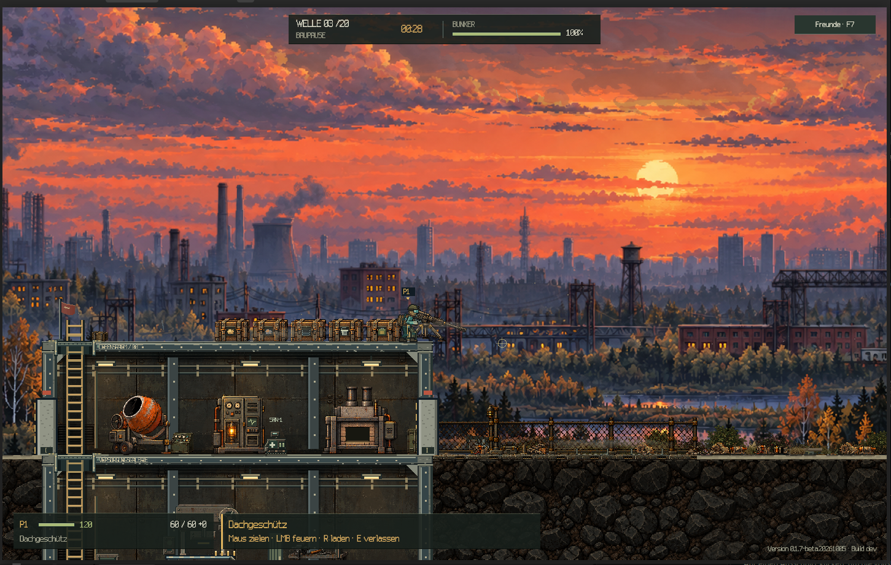
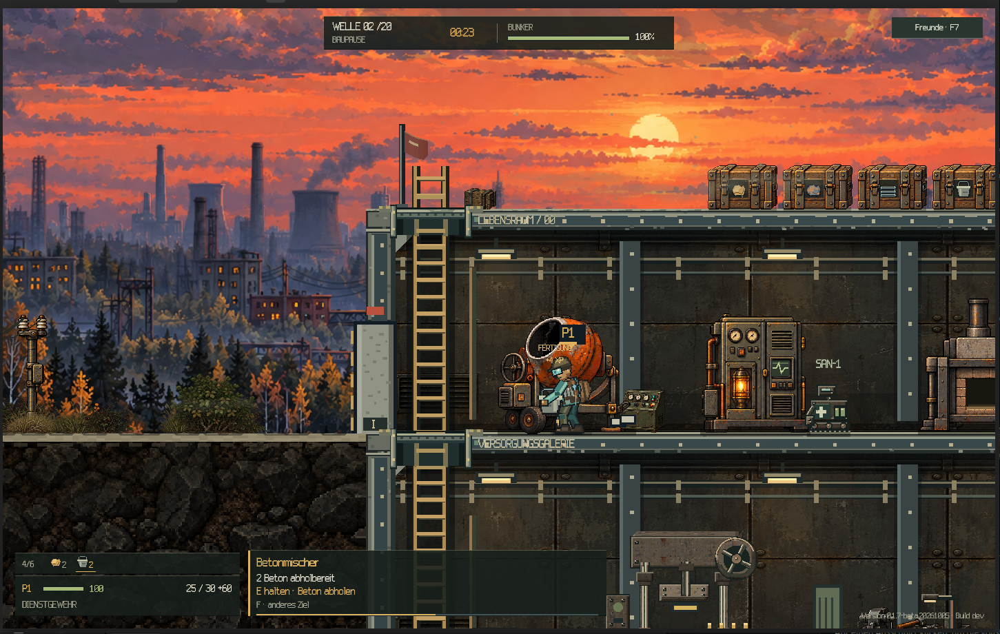

# DWAI-002 — Bunkercrew

**Status: development.**

A Godot game built around 2D cooperative bunker defense, mining, and material
production.

## The intended experience

Players share the work of keeping a bunker standing against attacking machines.
Some gather resources and produce metal or concrete; others reinforce defenses,
carry supplies, or operate a gun position. Players can change jobs as the next
urgent problem appears.

The central design moment: **hold the line while another player finishes the
wall.** Construction and combat should give players reasons to depend on each
other throughout a round.

## Current state

On **5 October 2026**, Christopher Spitzner described Bunkercrew as nearly
finished. This is a creator-reported development update, not a release or an
independent test result. The canonical registry status remains `development`.

## Gameplay evidence — 5 October 2026

The creator supplied five gameplay screenshots and a 59.62-second screen
recording. The visible build label is `0.1.7-beta.20261005`, marked `Build dev`.
This supersedes the earlier description of the footage as Beta 0.1.

*Occupied roof gun during the construction break before wave 3.*

*Concrete production and contextual controls in the running game.*

### What the supplied material shows

- Session setup with location, bunker type, position, and character choices.
- A player gathering underground resources and returning to the concrete mixer.
- Mixer input, a production countdown, and concrete ready for collection.
- Screenshots of steel ready for collection, machine enemies during an attack,
  a level-up notice, and a player occupying the roof gun.
- A wave counter, construction-break timer, bunker health, inventory, ammunition,
  and contextual interaction prompts.

The recording was inspected through sampled frames and media metadata. This is
visual evidence of a development build, not an independently executed playtest.
It does not establish multiplayer reliability, completion of all locations or
waves, save/load behavior, or release readiness.

### Media and availability

Public build, source, and hosted video links: Not recorded.

The supplied recording is 1444 × 906 pixels, approximately 30 frames per second,
and has no audio stream. The original video is not included in this repository.
The two screenshots above are unmodified captures supplied by the creator;
earlier concept illustrations are not presented as gameplay.

Release test results: Not recorded.

Historical development hours, costs, and human/AI contribution percentages:
Not recorded.

This record includes two gameplay screenshots, but no source code, playable
binaries, or individual runtime assets. No reuse license is granted for the
screenshots. Project source and runtime-asset licenses: Not recorded.

[Back to DONE WITH AI](../README.md) ·
[Project registry](../registry/projects.json)
